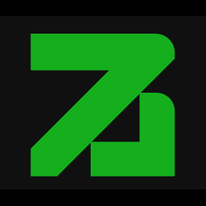

  

<h1 align="center"> Hi there, I'm Seif  </h1>

 
  

---

    <i>
        This is <b>Seif El-Deen</b>, a 3rd-year undergraduate <b>AI & Data Science</b> student at <b>Cairo University</b>.
         
        Specializing in <b>Deep Learning & Computer Vision</b> as my primary focus,
         
        backed by a strong, active foundation in <b>Frontend Engineering (Angular)</b>.  
         
        Currently leading both <b>Front-End & AI development</b> at <b>Baddel</b>  to build secure, intelligent marketplaces.
         
          
        ✨ <b>Actively seeking Internships & Junior positions in AI/ML & Computer Vision.</b>
    </i>

 
 
<h2 align="center"> My Technical Arsenal</h2>

  <table>
    <tr>
      <td align="center" width="33%">
        
         
        <b>The Brain (AI & ML)</b>
      </td>
      <td align="center" width="33%">
        
         
        <b>The Interface (Frontend)</b>
      </td>
      <td align="center" width="33%">
        
         
        <b>Core & Tools</b>
      </td>
    </tr>
    <tr>
      <td align="center" valign="top">
        
        
        
        
        
        
      </td>
      <td align="center" valign="top">
        
        
        
        
      </td>
      <td align="center" valign="top">
        
        
        
        
        
      </td>
    </tr>
  </table>

 
<h2 align="center">   Connect & Collaborate</h2> 

<table border="0">
<tr>
<td align="center" width="300">
<h3 align="center">💬 Direct Contact</h3>

 

 

</td>

<td align="center" width="100">

</td>

<td align="center" width="300">
<h3 align="center">💻 Dev & Social</h3>

 

 

</td>
</tr>
</table>

 
<h2 align="center">  Currently Building</h2>
<table align="center">
  <tr>
    <td align="center" width="120">
       
    </td>
    <td>
      <h3>Baddel | Trade Smart. Play Safe.</h3>
      
The first AI-powered secure marketplace for gaming assets in MENA.

      

        <code>Angular</code> <code>AI Verification</code>
      

    </td>
  </tr>
</table>

 
 

 

<h2 align="center"> Live Code Metrics</h2>

  
  
  
    

  

 

 

  
  
    
  
  <samp>
    See you in the next commit! 🚀
     
    <b>© 2025 Seif El-Deen</b>
  </samp>

